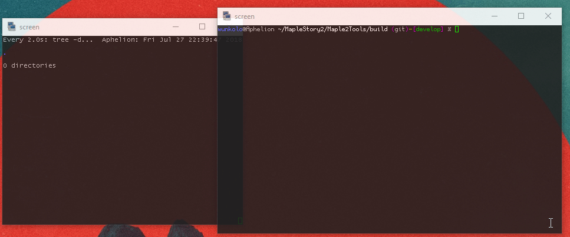
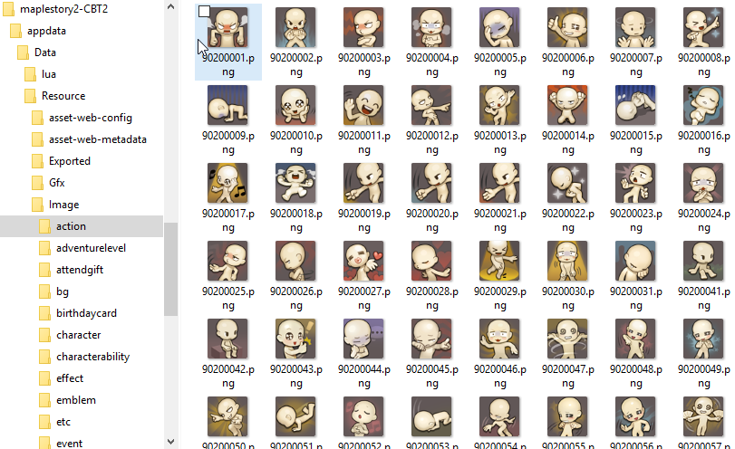
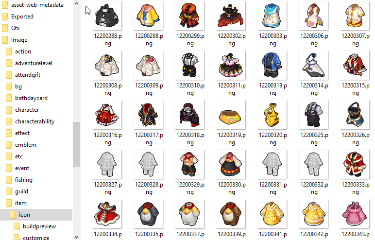

# Maple2Tools [](https://github.com/Wunkolo/Maple2Tools/blob/master/LICENSE)

Research and reverse engineering of [Nexon](http://nexon.net)'s [MapleStory 2](http://maplestory2.nexon.net/en). Check out the [XeNTaX](http://forum.xentax.com/viewtopic.php?f=10&t=18090) thread here.

## Dependencies

 * [Cmake 3.2.2+](https://www.cmake.org/download/)
 * [Crypto++ 7](https://github.com/weidai11/cryptopp)

# Building

Clone the repository:

`git clone --recursive https://github.com/Wunkolo/Maple2Tools`

## Windows

`TODO:` At the moment [getting Crypto++ to work with CMake](https://www.cryptopp.com/wiki/Cmake#CMake_Removal) is proving to be a feat that will require some manual tinkering to get this to build on windows. This is the only thing in the way of getting a concise Windows build as the rest of the code is portable and build-able on windows but a simple way to link Crypto++ requires some overhead. Feel free to contribute a pull request if you manage to get a build going.

## Linux

Typical [CMake out-of-source build procedure](http://preshing.com/20170511/how-to-build-a-cmake-based-project/#running-cmake-from-the-command-line):

```
cd Maple2Tools
mkdir build
cd build
cmake ..
make
```
All targets will then be generated in the `build` directory.

# Usage

## Expand

```
MapleStory2 Filesystem expander:
        "Flattens" a filesystem, expanding all m2h/m2d files it encounters
        into a folder of the same name
Build Date: Fri Jul 27 22:55:15 2018
        - wunkolo <wunkolo@gmail.com>
usage:
  Expand <Source path> <Destination path> options

where options are:
  -?, -h, --help                       display usage information
  -s, --shadow <none|sym|hard|copy>    Determines how the original files will
                                       be recreated in the dump

                                       none - No shadowing
                                       sym  - Creates symbolic links in the
                                       dump folder(default)
                                       hard - Creates hard links in the dump
                                       folder
                                       copy - Copies the original file into
                                       the dump folder

```
[Expand](tools/Expand.cpp) will recursively dive into a target folder(such as your MapleStory2 game directory) and expand each `m2h`/`m2d` pair it encounters. It will optionally "shadow" the target folder's original files as well(the ones that are not `m2h`/`m2d` files). For the `.m2h`/`.m2d` files it encounters it will instead create a folder of the same name populated with its extracted contents(Ex: `Xml.m2h`/`Xml.m2d` will create an `Xml` folder with its unpacked contents).
This effectively flattens out the entire runtime virtual file system(internally named `CFileSystem`) of MapleStory 2.
The expander is very fast and multi-threaded and will create a new thread to extract with in parallel for every `.m2h/.m2d` pair it encounters utilizing memory mapped files for extra speed.
It is recommended to run this on non-mechanical memory such as a solid state drive or RAM drive( such as 'tmp' on linux).




## Pack

[Pack](tools/Pack.cpp) will dive into a directory and will recursively add each file into a `.m2h/.m2d` archive pair using the specified `PackStream` version.
Pretty much does the exact opposite of `Expand`.
```
$ Pack MS2F Assets/MyFiles
MapleStory2 Filesystem packer:
	"Packs" a filesystem, creating an .m2h/.m2d pair
	of the original folder's name
Build Date: Tue May 29 23:30:07 2018
	- wunkolo <wunkolo@gmail.com>
Usage: Pack (M2SF/N2SF/O2SF/P2SF) (List of folders to pack)

Creating header file: ...Assets/MyFiles.m2h
Creating data file: ...Assets/MyFiles.m2d
1,blah.txt
2,Folder1/test.txt
3,.hidden

```
```
$ tree Assets
Assets/
├── MyFiles
│   ├── Folder1
│   │   └── test.txt
│   └── blah.txt
├── MyFiles.m2d
└── MyFiles.m2h
```
